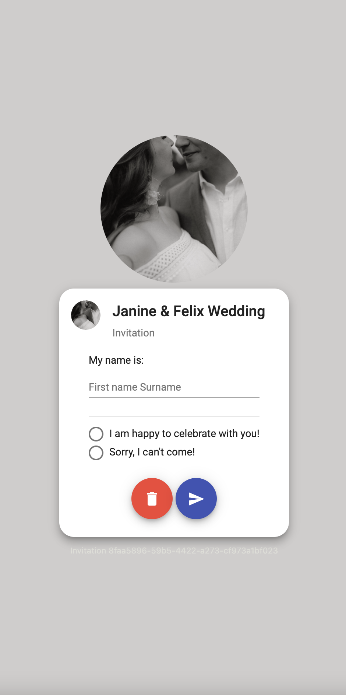
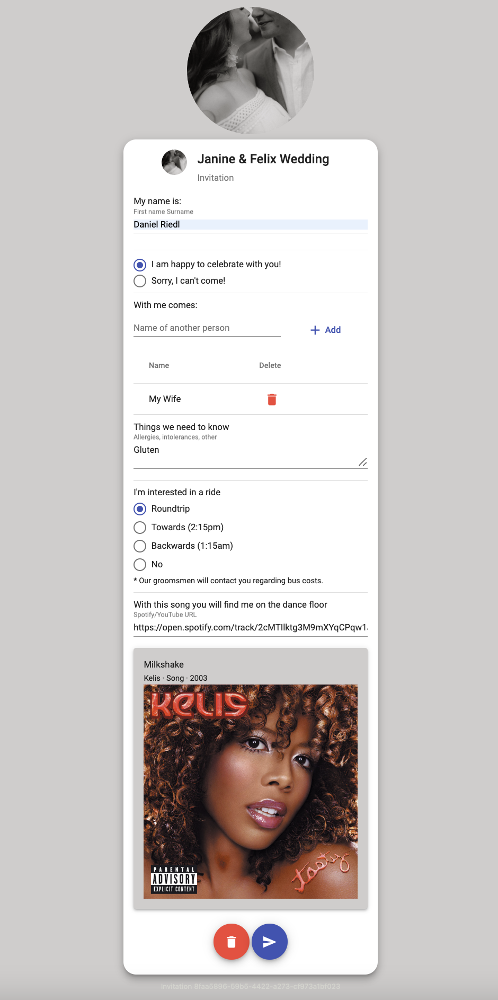

# Wedding Invitation Stack



## Why
This project was created for friends of us. <br />
They wanted to have a QR code on their wedding invitation, where one can accept or reject the invitation.

## Suit it for your usecase
As you can see in the pictures above it's tailored for both of them.
But of course you can fork this repository and make it your own.

### Text
There are translate files, so you can adjust the text in:
- `frontend/src/assets/i18n/de.json`
- `frontend/src/assets/i18n/en.json`
  
As I'm still learning Angular and it's a pain in the a**, I would be happy if someone could check the ngx-translate settings :poop:
### Image
I used Photopea for creating the image and used the Twitter Profile (400x400)
- `frontend/src/assets/img/wiesers-v2-round.png`

## Requirements
For running the stack:
- Docker
- Docker compose

For developing the stack:
- Go 1.19
- Angular 14
  
## Usage

Clone it!

```
$ git clone https://github.com/danriedl/wedding-invitation-stack.git
```

Go into the project directory and run the command:

```
$ docker-compose up -d
```

Open `http://localhost:8080` and enjoy!

### Backend

- Start server - `$ cd backend && go run main.go`

### Frontend

- Start server - `$ cd frontend && ng serve --open --proxy-config proxy.config.json`
